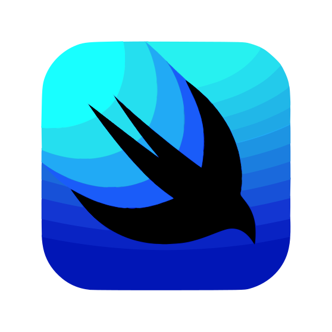
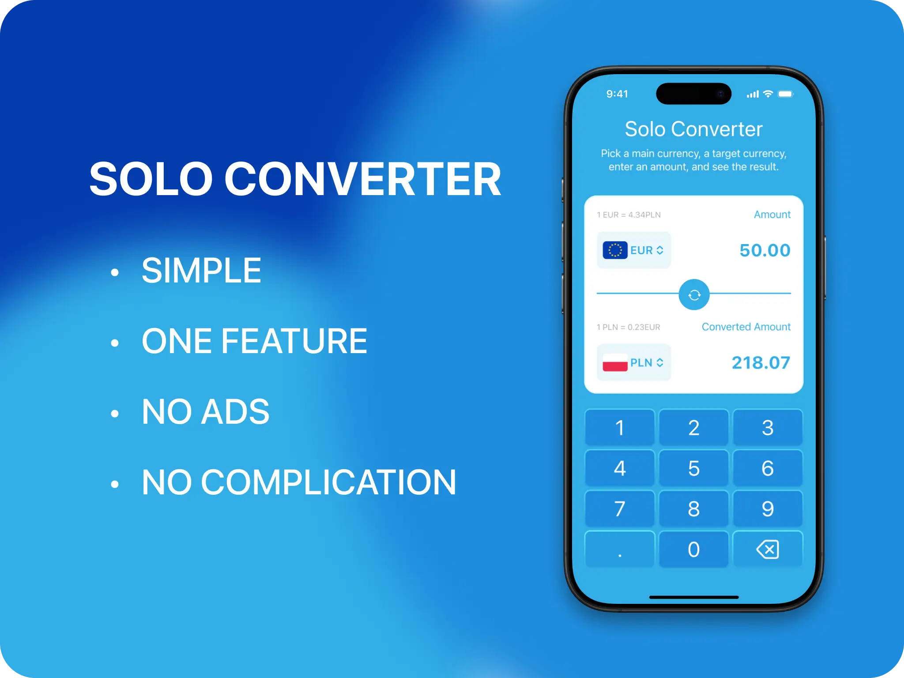

   

# Hi 👋 there!

So glad you've dropped by my coding corner. Here, it's all about ios
coding magic.

Between coding sessions, I'm probably out cycling 🚴‍♂️ or having fun annoying my
kids (they secretly love it 😁).

Dive 👀 into my projects, see what sparks joy, and let's chat 💬 about anything
from tech to the best cycling routes.

Happy exploring!

# Project: Solo Currency Converter App

### Overview

A simple, user-friendly app designed to convert currency based on user local currency.

Your users should be able to:

- Enter an amount in one field to convert it to another currency.
- Select currency from list of countries.
- Save preferred currencies for future use.
- Switch between "from" and "to" currencies for conversions.

### Tech Stack:

- Swift;
- SwiftUI;
- TipKit
- Xcode
- Git
- GitHub

## Author

- LinkedIn - [Serhii Orlenko](https://www.linkedin.com/in/grifano/)
